

  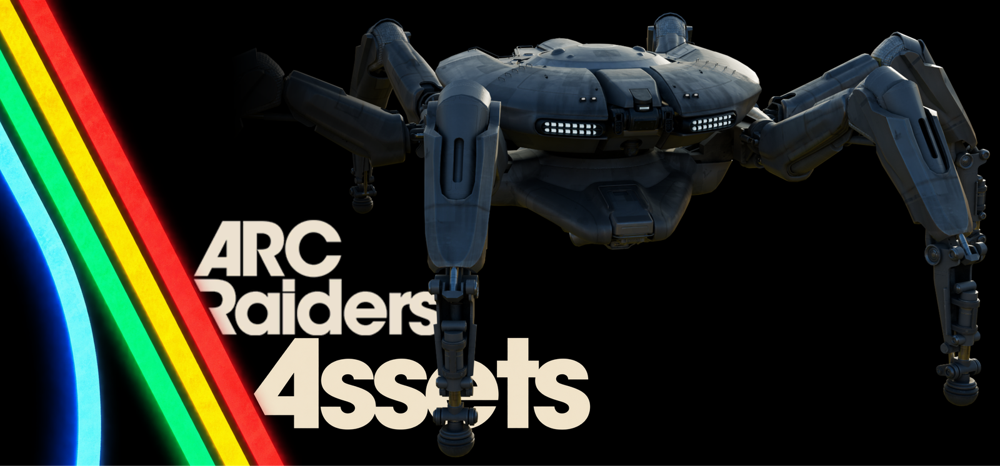

ARC Raiders 3D models, renders, UI Images, data, and extraction resources.

  <a href="Objects/Arc/">3D MODELS</a> &nbsp;·&nbsp;
  <a href="Images/">UI IMAGES</a> &nbsp;·&nbsp;
  <a href="Game_Text/">GAME TEXT</a> &nbsp;·&nbsp;
  <a href="Mappings/">MAPPINGS</a> &nbsp;·&nbsp;
  <a href="Renders/">RENDERS</a> &nbsp;·&nbsp;
  <a href="Stats/">COMBAT STATS</a>

---

### Archive

| | |
|:--|:--|
| **[3D models](Objects/Arc/)** | 27 textured ARC `.blend` files. Contain packed textures, probably only work on Blender 5.0+. |
| **[Images](Images/)** | Extracted icons, UI elements, cosmetics, items, store artwork, maps, and other images. |
| **[Game text](Game_Text/)** | In-game text, translations, dialogue and credits. |
| **[Mappings](Mappings/)** | `.usmap` mappings and AES key to use in fmodel ([V2.02 Mappings](Mappings/5.7.4-inheritance+pioneer_2.02.x-PioneerGame.usmap)). |
| **[Renders](Renders/)** | ARC renders and README previews. |
| **[Combat stats](Stats/)** | ARC machine health, damage against Raiders, shields and game files. |

**Last Updated:** game version **2.2.0**. Some collections and models may be from different versions.

### Combat stats

- **[ARC machine stats](Stats/ARC/)** — Frame and part HP, armor, weak points, and damage resistance for 26 machines.
- **[Weapon stats](Stats/Weapons/)** — Body damage and headshot multipliers against Raiders, ARC damage, falloff, and Amplified configs.
- **[Shield stats](Stats/Shields/)** — Shield strength, damage reduction, and movement speed for Raiders.

  <a href="Stats/ARC/Renders/Leaper/01_Original_Materials_A.png">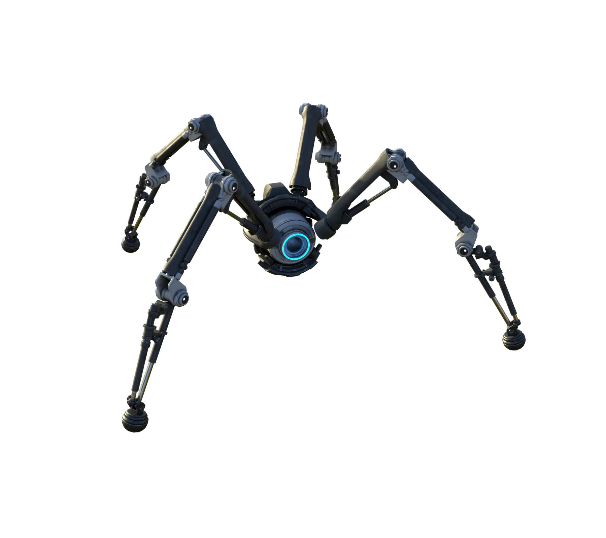</a>
   
  <a href="Stats/ARC/Bastion.md">Bastion</a> &nbsp;·&nbsp; <a href="Stats/ARC/Rocketeer.md">Rocketeer</a> &nbsp;·&nbsp; <a href="Stats/ARC/Leaper.md">Leaper</a>

### Renders

  <a href="Renders/Chonk.png">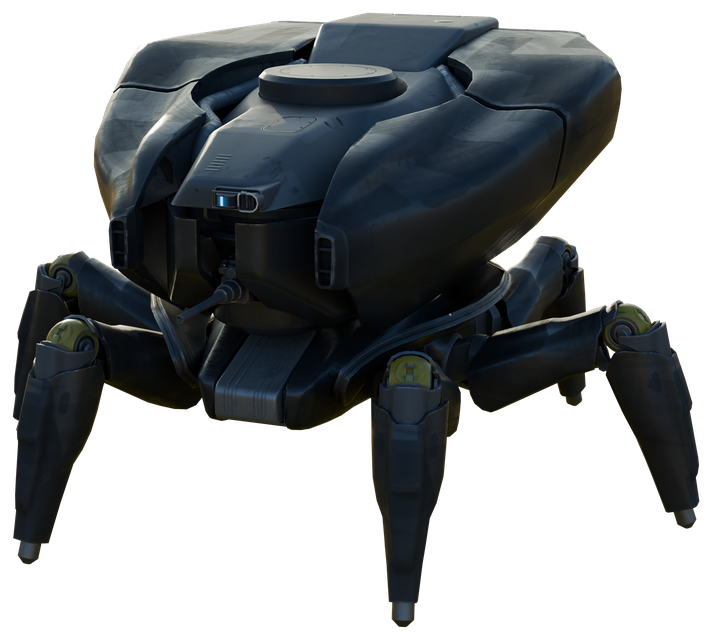</a>

  

  <a href="Renders/EliteDrone_Flamethrower.png">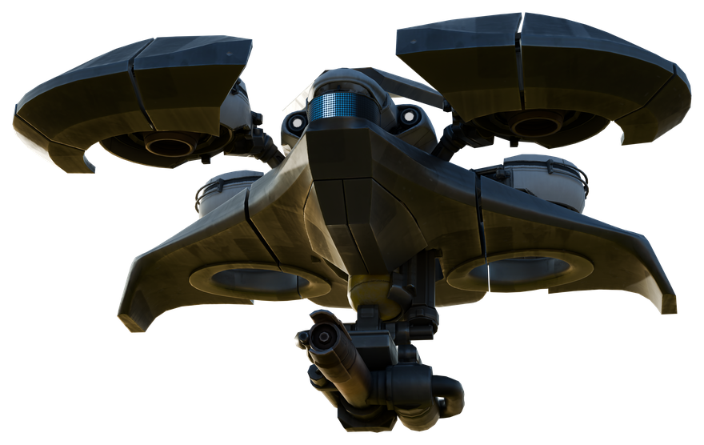</a><a href="Renders/Tarragon.png">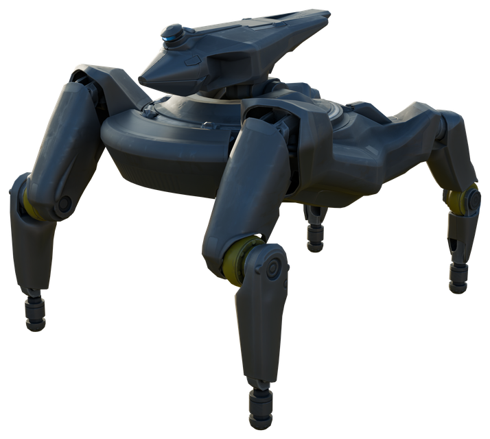</a>

More renders

 

  <a href="Renders/Bullcrab_angry.png">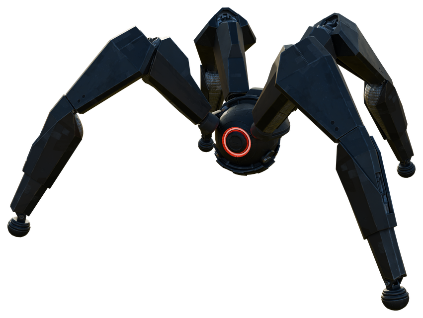</a><a href="Renders/Catnip.png">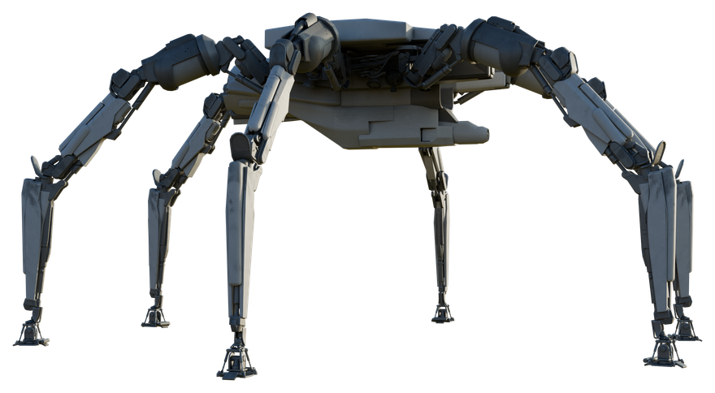</a>

  <a href="Renders/EliteDrone.png">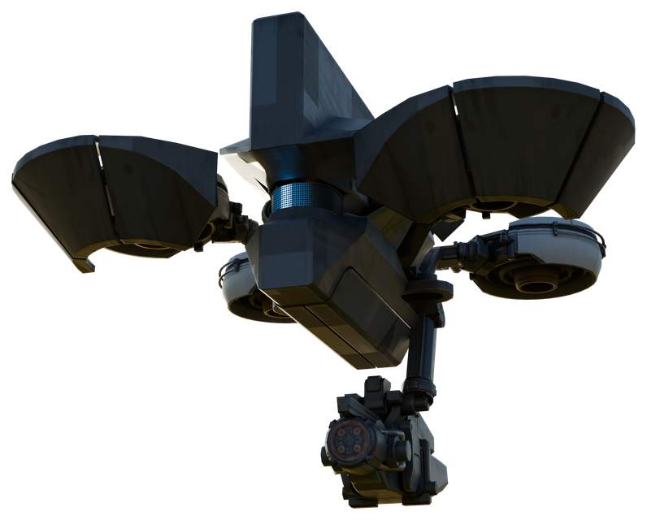</a>

  <a href="Renders/Monolith.png">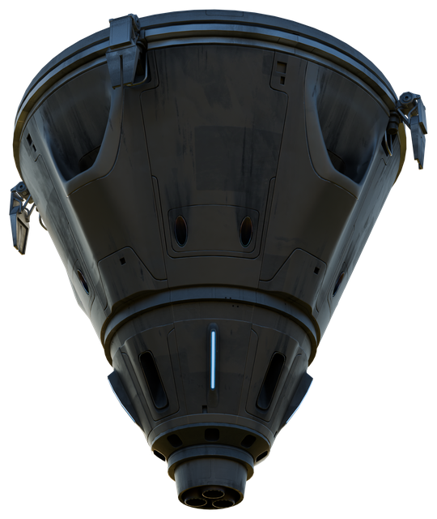</a>

  <a href="Renders/RollBot.png">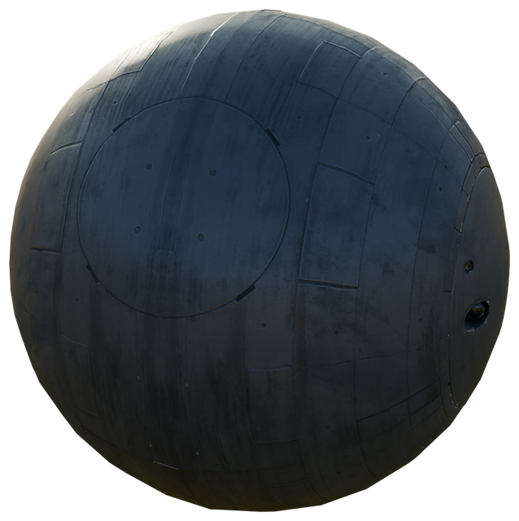</a><a href="Renders/RollBot_Boom.png">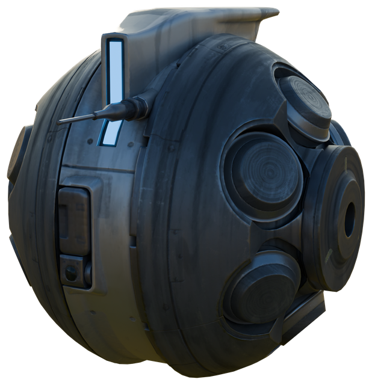</a>

  <a href="Renders/ScoutDrone.png">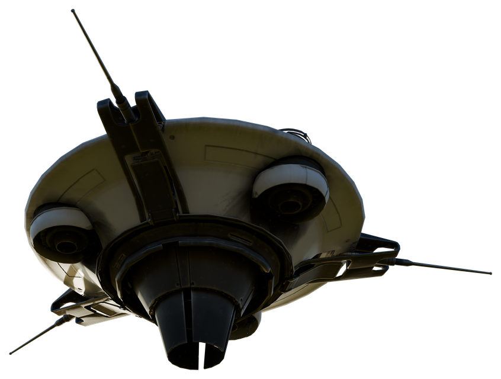</a>

  <a href="Renders/Turret.png">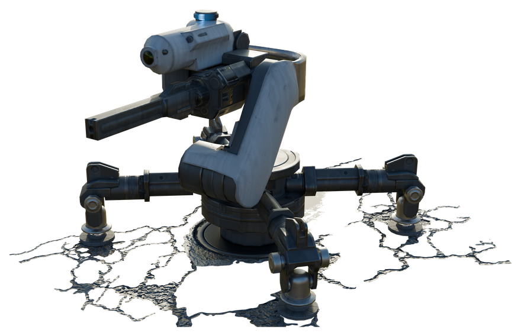</a><a href="Renders/Wasp.png">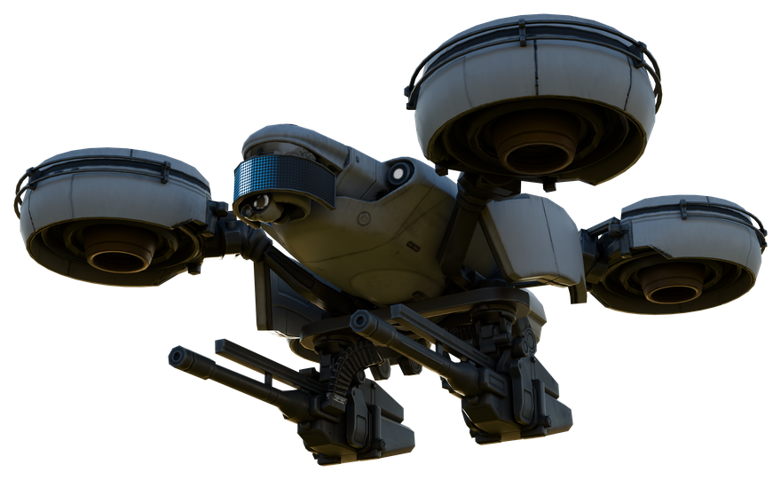</a>

<a href="Renders/">Full-resolution renders</a> &nbsp;·&nbsp; <a href="Renders/Firefly_scan.gif">Firefly scanning animation</a>

### Extracting assets

The old Ninja Ripper method is outdated. Use **[FModel](https://fmodel.app/)** with the ARC Raiders game files instead.

1. Install or update FModel and select **`GAME_ArcRaiders`** as the game profile.
2. Point FModel torwards your ARC Raiders game files (Probably "C:\Program Files (x86)\Steam\steamapps\common\ARC Raiders\PioneerGame\Content\Paks").
3. Add the AES key from **[Mappings/AES.txt](Mappings/AES.txt)** and use the latest **[mapping (`.usmap`) file](Mappings/)**.
4. Browse and export the assets you need.

For more help, assets, and an automatic model texturer visit the [Blend Raiders Discord](https://discord.gg/8xZHEudWN2) or the [community archive](https://drive.google.com/drive/folders/1BSm-QteBKxMn7CyHkg72xkPnjQRQJnJP?usp=sharing).

### Credits

Maintained by **[Teralix42](https://github.com/Teralix42)**. This archive builds on work from **[AstroVal0](https://github.com/astroval0)** and **[Silarious](https://watch.silarious.online)**. The `Objects/` collection is now my own reconstruction and material work; please credit Teralix42 when using them.

*Unofficial fan-maintained resource. ARC Raiders and its game assets belong to Embark Studios. This archive is not affiliated with or endorsed by Embark Studios.*
